# Professional Casino & Slot Games Platform

<div align="center">

### **Enterprise-Grade Gaming Solution for Modern Casinos**

**Real-Time Multiplayer • Scalable Architecture • Production-Ready**

[](https://laravel.com)
[](https://nodejs.org)
[](https://websocket.org)
[](https://mysql.com)
[](https://redis.io)

<div align="center">
  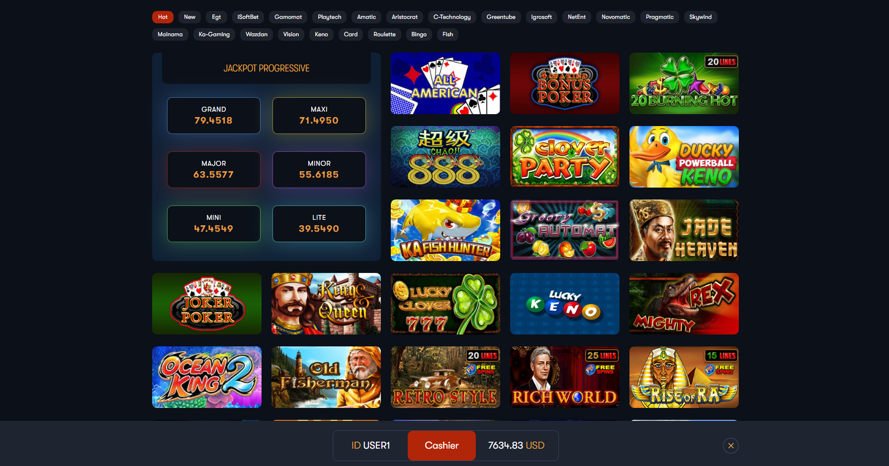
  <p><em>Beautiful and intuitive user interface with game library, easy navigation, and modern design</em></p>
</div>

<div align="center">

### 📞 **Contact Us on Telegram**

[](https://t.me/sunnra0x0)

**[👉 Click Here to Contact: @Sunnra0x0 👈](https://t.me/sunnra0x0)**

</div>

</div>

---

## 🌟 **Why Choose Our Platform?**

Transform your casino business with a **complete, enterprise-ready gaming solution** that combines cutting-edge technology with proven reliability. Our platform delivers:

- ⚡ **Lightning-Fast Performance** - Real-time gameplay with sub-second latency
- 🎮 **Multiple Game Types** - Slot games, arcade games, **BuffaloThunder fishing games**, and more
- 🔒 **Enterprise Security** - Secure authentication, balance management, and transaction processing
- 📈 **Scalable Architecture** - Handle thousands of concurrent players effortlessly
- 💰 **Real-Time Balance Management** - Instant balance updates with Redis caching
- 🌐 **Multi-Player Support** - Social gaming with room-based multiplayer experiences
- 📊 **Comprehensive Analytics** - Track player behavior, game statistics, and revenue
- 🚀 **Easy Integration** - RESTful APIs and WebSocket connections for seamless integration
- 🎨 **Fully Customizable** - White-label solution with custom branding, features, and business logic
- 🎛️ **Powerful Admin Dashboard** - Complete control over operations, users, games, and analytics

---

## ✨ **Key Features & Capabilities**

### 🎯 **Core Gaming Features**

| Feature | Description | Benefit |
|---------|-------------|---------|
| **Real-Time Multiplayer** | WebSocket-based game rooms supporting up to 6 players per room | Create engaging social gaming experiences |
| **Multiple Game Types** | Slot games, arcade games, **BuffaloThunder fishing games**, and more | Diversify your game portfolio |
| **Auto-Scaling Rooms** | Dynamic room creation based on player demand | Optimal resource utilization |
| **Scripted Game Events** | Boss fish, tides, special events, and dynamic gameplay | Keep players engaged with exciting features |
| **Balance Synchronization** | Three-tier system (Client → Redis → MySQL) | Fast updates with data persistence |

### 💼 **Business Features**

| Feature | Description | Benefit |
|---------|-------------|---------|
| **User Management** | Complete authentication, authorization, and user profiles | Secure player accounts |
| **Balance Management** | Real-time balance tracking with Redis caching | Instant transactions |
| **Game Statistics** | Track bets, wins, RTP, and player behavior | Data-driven business decisions |
| **Shop Management** | Multi-shop support with individual configurations | Scale across multiple locations |
| **Jackpot System** | Progressive jackpots and bonus features | Increase player engagement |
| **Tournament Support** | Organize competitions and leaderboards | Boost player retention |

### 🔧 **Technical Features**

| Feature | Description | Benefit |
|---------|-------------|---------|
| **Laravel Backend** | Robust PHP framework for web services | Reliable, maintainable codebase |
| **Node.js WebSocket Server** | High-performance real-time game server | Low-latency gameplay |
| **Redis Caching** | Fast balance and session management | Sub-millisecond response times |
| **MySQL Database** | Persistent data storage with connection pooling | Reliable data integrity |
| **RESTful APIs** | Clean API endpoints for game communication | Easy third-party integration |
| **Multi-Language Support** | Internationalization ready | Global market reach |

---

## 🎛️ **Admin Dashboard & Management**

Our platform includes a **comprehensive, feature-rich admin dashboard** that gives you complete control over your casino operations. The admin panel is designed for efficiency, with role-based access control and intuitive navigation.

<div align="center">
  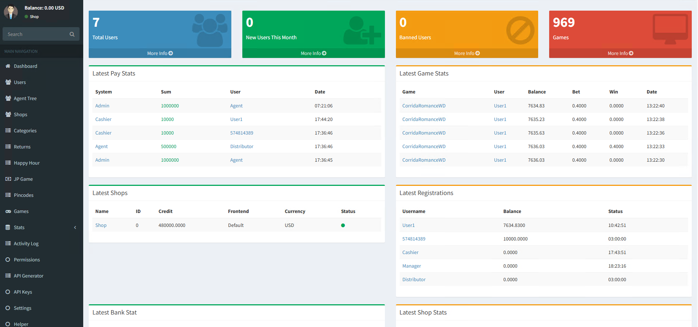
  <p><em>Complete admin dashboard with all management features - User management, game settings, statistics, and more</em></p>
</div>

### **🔐 Admin Dashboard Features**

#### **User & Account Management**
- ✅ **User Management** - Create, edit, and manage player accounts
- ✅ **User Search** - Advanced search functionality to find any user quickly
- ✅ **Account Management** - Handle cashier accounts, managers, and agents
- ✅ **Shop Management** - Multi-shop support with individual configurations
- ✅ **Distributor Management** - Manage distributors and their networks
- ✅ **Role-Based Access Control** - Admin, Agent, Manager, Cashier roles with granular permissions

<div align="center">
  
  <p><em>Comprehensive user and account management system</em></p>
</div>

#### **Transaction & Financial Management**
- ✅ **Transaction History** - Complete transaction logs with filtering and search
- ✅ **Balance Management** - Add/remove balances, view transaction details
- ✅ **Payment Settings** - Configure payment methods, limits, and currencies
- ✅ **Bank Management** - Manage payment banks and configurations
- ✅ **Refund Processing** - Handle refunds and dispute resolution

#### **Game Management**
- ✅ **Game Library** - Add, edit, and manage all games
- ✅ **Game Settings** - Configure RTP, win rates, and game parameters
- ✅ **Game Categories** - Organize games by categories
- ✅ **Win Settings** - Customize win probabilities and payouts
- ✅ **Mass Game Operations** - Bulk update game settings
- ✅ **Jackpot Management** - Configure and manage progressive jackpots

#### **Statistics & Analytics**
- ✅ **Dashboard Overview** - Real-time statistics and KPIs
- ✅ **Game Statistics** - Detailed game performance metrics
- ✅ **Bank Statistics** - Financial overview and trends
- ✅ **Live Statistics** - Real-time player activity
- ✅ **Shop Statistics** - Performance by location
- ✅ **Shift Statistics** - Track daily operations and shifts
- ✅ **Daily Reports** - Comprehensive daily reports
- ✅ **Game Reports** - Per-game analytics and performance

<div align="center">
  
  <p><em>Comprehensive analytics and reporting dashboard with real-time statistics</em></p>
</div>

#### **Bonus & Promotion Management**
- ✅ **Bonus Settings** - Configure welcome bonuses, progress bonuses, and more
- ✅ **Bonus Logs** - Track all bonus distributions
- ✅ **Happy Hour** - Schedule and manage happy hour promotions
- ✅ **Progress Bonuses** - Set up tiered bonus systems
- ✅ **Invite Friends** - Manage referral programs
- ✅ **Tournaments** - Create and manage gaming tournaments
- ✅ **Welcome Bonuses** - Configure first-deposit bonuses

#### **System Configuration**
- ✅ **General Settings** - App name, frontend themes, site status
- ✅ **Authentication Settings** - Login options, password policies, 2FA
- ✅ **Security Settings** - Security configurations and policies
- ✅ **SMS Settings** - SMS gateway configuration for notifications
- ✅ **Payment Settings** - Payment gateway integrations
- ✅ **Maintenance Mode** - Enable/disable server maintenance
- ✅ **Advertisement Settings** - Manage promotional content

#### **Additional Features**
- ✅ **Terminal Management** - Manage physical terminals and ATMs
- ✅ **API Key Management** - Generate and manage API keys
- ✅ **Game Logs** - Detailed game session logs
- ✅ **Support System** - Customer support ticket management
- ✅ **Articles & News** - Content management for announcements
- ✅ **Pincode Management** - Secure pincode system
- ✅ **Daily Entry** - Daily login bonuses and rewards

---

## 👥 **User Interface & Player Experience**

The **player-facing interface** is designed for maximum engagement and ease of use, providing an immersive gaming experience across all devices.

<div align="center">
  
  <p><em>Beautiful and intuitive user interface with game library, easy navigation, and modern design</em></p>
</div>

### **🎮 Player Features**

#### **Game Experience**
- 🎰 **Game Library** - Browse hundreds of slot games, arcade games, and **BuffaloThunder fishing games**
- 🔍 **Game Search** - Quick search to find favorite games
- 📱 **Responsive Design** - Seamless experience on desktop, tablet, and mobile
- 🎯 **Game Categories** - Organized by game type for easy navigation
- ⚡ **Instant Loading** - Fast game loading with optimized assets
- 🎨 **Beautiful UI** - Modern, attractive interface design

#### **Account Management**
- 👤 **User Profile** - Manage personal information and preferences
- 🔐 **Secure Login** - Multiple authentication options including 2FA
- 💰 **Balance Display** - Real-time balance updates
- 📊 **Game History** - View past game sessions and results
- 🏆 **Achievements** - Track progress and achievements
- 📈 **Statistics** - Personal gaming statistics

#### **Social & Engagement**
- 🎪 **Tournaments** - Participate in competitive tournaments
- 🎁 **Bonuses** - View and claim available bonuses
- 📜 **FAQ** - Comprehensive help and support section
- 📢 **Announcements** - Stay updated with latest news
- 🎉 **Progress Tracking** - Track bonus progress and rewards
- 👥 **Invite Friends** - Referral program participation

#### **Payment & Transactions**
- 💳 **Deposit Options** - Multiple payment methods
- 💸 **Withdrawal** - Secure withdrawal processing
- 📋 **Transaction History** - Complete transaction records
- 💵 **Balance Management** - Easy deposit and balance viewing

---

## 🎨 **Customization & White-Label Solutions**

### **✨ Fully Customizable Platform**

Our platform is **designed for customization** to meet your unique business requirements. We understand that every casino operator has different needs, and we're committed to providing solutions tailored to your brand and operations.

### **🎯 Customization Options**

#### **Branding & Design**
- 🎨 **Custom Themes** - Fully customizable frontend themes and layouts
- 🖼️ **Logo & Branding** - Add your logo, colors, and brand identity
- 🎭 **UI/UX Customization** - Modify interface elements, colors, fonts, and layouts
- 📱 **Responsive Design** - Customize mobile and desktop experiences
- 🌐 **Multi-Language** - Add custom languages and translations

#### **Functional Customization**
- ⚙️ **Game Configuration** - Customize game settings, RTP, and mechanics
- 💰 **Payment Integration** - Add custom payment gateways and methods
- 📊 **Reporting** - Custom reports and analytics dashboards
- 🔔 **Notification System** - Custom notification templates and triggers
- 🎁 **Bonus Systems** - Design custom bonus and promotion systems
- 🏆 **Tournament Rules** - Create custom tournament formats

#### **Business Logic**
- 📈 **Revenue Models** - Customize commission structures and profit sharing
- 🏪 **Shop Configuration** - Multi-shop setups with individual rules
- 👥 **User Roles** - Create custom roles and permission sets
- 🔐 **Security Policies** - Customize authentication and security rules
- 📋 **Workflow Automation** - Custom business process automation

#### **Integration & API**
- 🔌 **Third-Party Integrations** - Integrate with external services
- 📡 **Custom APIs** - Develop custom API endpoints
- 🔄 **Data Migration** - Import existing player data and configurations
- 📦 **Module Development** - Add custom features and modules

### **🛠️ Custom Development Services**

We offer **professional custom development services** to implement your specific requirements:

- ✅ **Feature Development** - Build custom features from scratch
- ✅ **Integration Services** - Integrate with your existing systems
- ✅ **UI/UX Design** - Custom interface design and implementation
- ✅ **Performance Optimization** - Optimize for your specific use case
- ✅ **Security Enhancements** - Additional security features
- ✅ **Testing & QA** - Comprehensive testing of custom features
- ✅ **Documentation** - Custom documentation for your setup
- ✅ **Training & Support** - Training for your team

### **💼 White-Label Solution**

Transform the platform into **your own branded casino solution**:

- 🏷️ **Complete Rebranding** - Remove all references to original branding
- 🎨 **Custom Domain** - Use your own domain name
- 📧 **Custom Email** - Branded email communications
- 📄 **Custom Terms** - Your terms and conditions
- 🔒 **Data Ownership** - Complete ownership of all data
- 🚀 **Independent Deployment** - Deploy on your own infrastructure

### **📋 How to Request Customization**

1. **Contact Us** - Reach out with your customization requirements
2. **Requirements Analysis** - We'll analyze your needs and provide a proposal
3. **Development** - Our team will implement your customizations
4. **Testing** - Thorough testing with your team
5. **Deployment** - Smooth deployment and go-live support

**We're committed to making the platform work exactly as you need it!**

---
---

## 🎮 **Supported Game Types**

### **1. Slot Games** 🎰
- Classic 3-reel and 5-reel slots
- Multiple paylines and bet levels
- Free spins, bonus rounds, and multipliers
- Gamble features
- Progressive jackpots

<div align="center">
  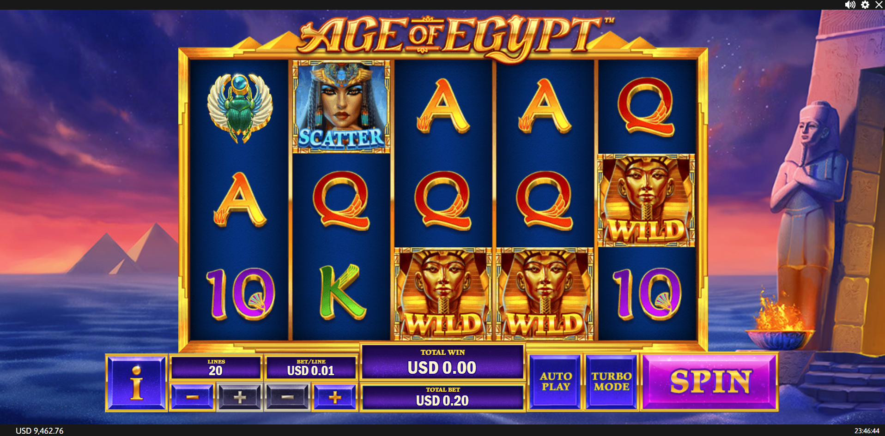
  <p><em>Premium slot games with stunning graphics and exciting features</em></p>
</div>

#### **Slot Game Gallery**

<div align="center">
  
| | | |
|:---:|:---:|:---:|
| 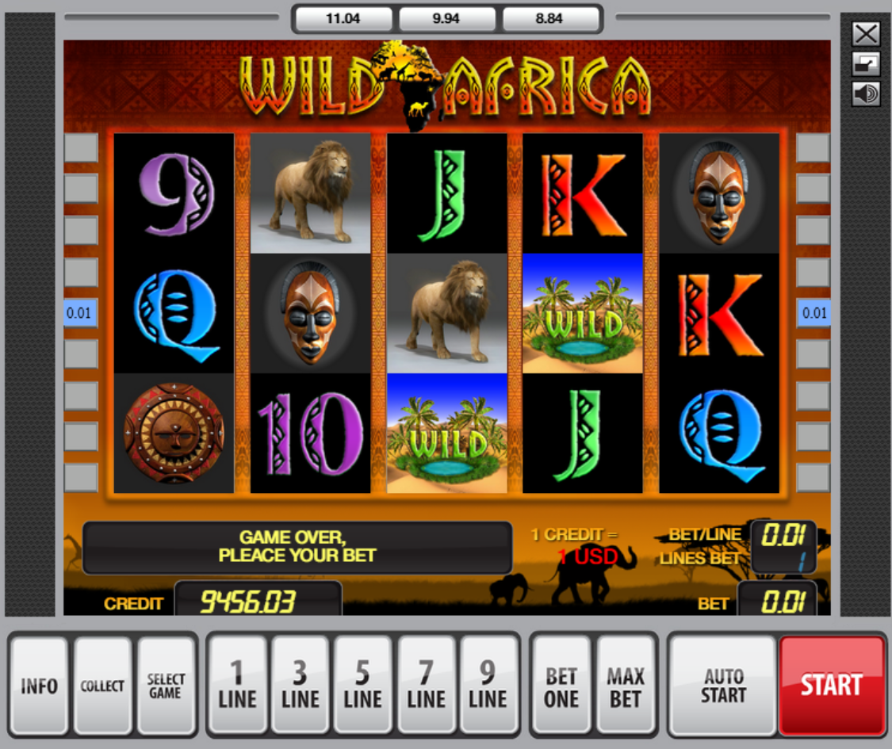 | 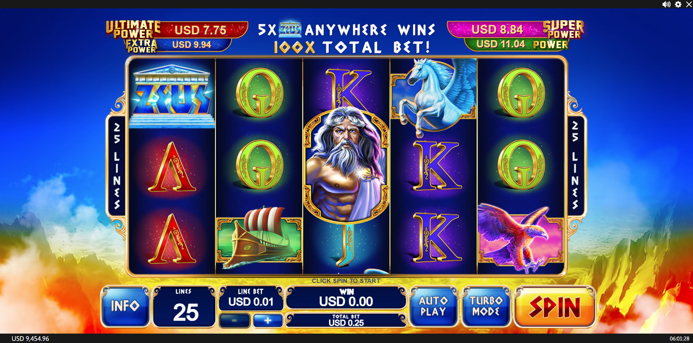 | 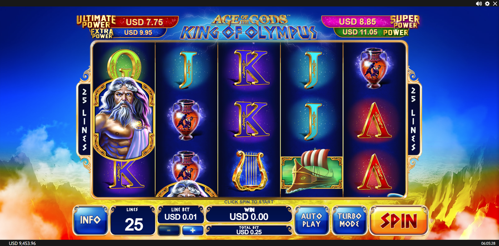 |
| 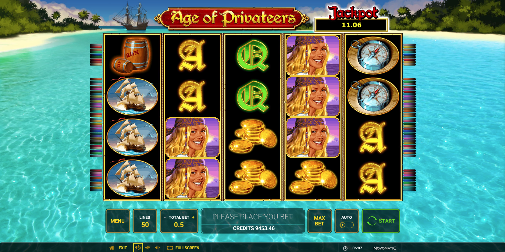 | 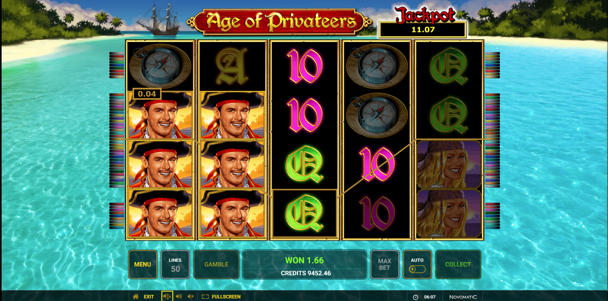 | 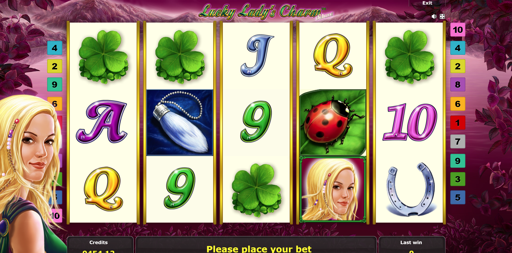 |
| 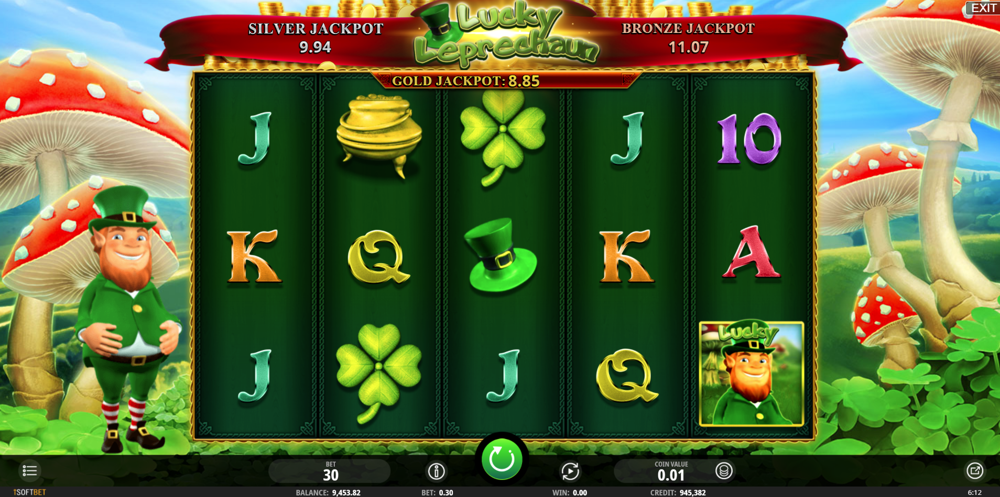 | 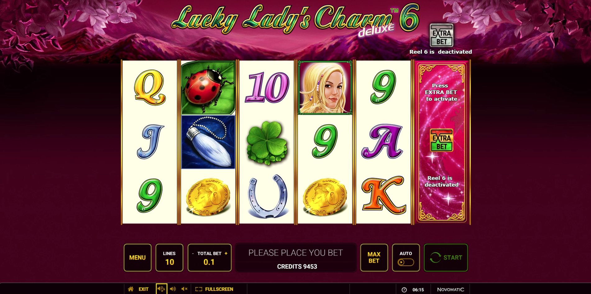 | 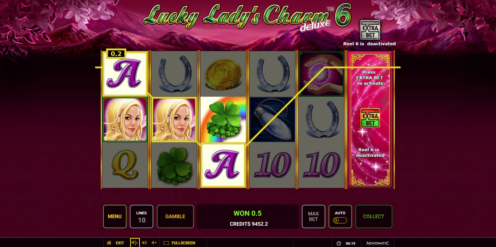 |
| 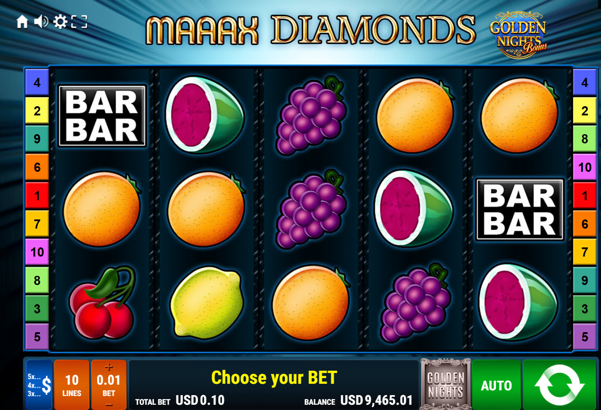 | | |

<p><em>Diverse collection of premium slot games with various themes and features</em></p>

</div>

### **2. Arcade Games** 🕹️
- Action-packed arcade experiences
- Skill-based gameplay
- Tournament support
- Leaderboards and achievements

<!-- Add arcade game screenshot here -->
<!-- <div align="center">
  
</div> -->

### **3. Fishing Games** 🎣
- Multiplayer fishing game
- Real-time multiplayer rooms (up to 6 players)
- Dynamic fish spawning with scripts
- Boss fish and special events
- Auto-fire and manual shooting modes
- Tide system for dynamic gameplay

<div align="center">
  
  <p><em>Premium multiplayer fishing game with real-time action, boss fish, and exciting gameplay features</em></p>
</div>

### **4. Custom Games** 🎲
- Easy integration for new game types
- Flexible game room system
- Customizable game logic
- Plugin architecture

---

## 🚀 **Quick Start Guide**

### **Prerequisites**

- PHP 8.2 or higher
- Node.js 14 or higher
- MySQL 8.0 or higher
- Redis 6.0 or higher
- Composer (PHP dependency manager)
- NPM (Node.js package manager)

### **Installation Steps**

#### **1. Clone and Install Dependencies**

```bash
# Install PHP dependencies
composer install

# Install Node.js dependencies for WebSocket server
cd PTWebSocket/Fishing
npm install
```

#### **2. Configure Environment**

```bash
# Copy environment file
cp .env.example .env

# Generate application key
php artisan key:generate

# Configure database and Redis settings in .env
```

#### **3. Setup Database**

```bash
# Run migrations
php artisan migrate

# Seed initial data (optional)
php artisan db:seed
```

#### **4. Configure WebSocket Server**

Edit `public/arcade_config.json`:

```json
{
    "port": 8010,
    "host": "your-server-ip",
    "prefix": "http://",
    "host_ws": "your-server-ip",
    "prefix_ws": "ws://",
    "ssl": false
}
```

#### **5. Start Services**

```bash
# Start Laravel development server
php artisan serve

# Start WebSocket server (in separate terminal)
cd PTWebSocket/Fishing
node Arcade.js
```

#### **6. Access the Platform**

- **Frontend**: `http://localhost:8000`
- **WebSocket Server**: `ws://your-server-ip:8010/websocket`

---

## 📋 **Complete Workflow**

### **Player Journey**

1. **User Registration/Login** → Laravel authenticates and creates session
2. **Game Selection** → User browses available games
3. **Game Loading** → Laravel serves game iframe with configuration
4. **WebSocket Connection** → Game connects to real-time server
5. **Room Assignment** → Server assigns player to appropriate game room
6. **Real-Time Gameplay** → Player interacts with game, balance updates instantly
7. **Balance Sync** → Changes sync to Redis cache and MySQL database

### **Technical Flow**

```
User Login
    ↓
Laravel Authentication
    ↓
Game Selection → Load Game View
    ↓
Game Client Initializes
    ↓
Read arcade_config.json → Get WebSocket URL
    ↓
Connect to WebSocket Server
    ↓
Authentication Message → Server Validates
    ↓
Create/Find Game Room → Assign Player
    ↓
Game Loop Starts → Real-Time Gameplay
    ↓
Balance Updates (Redis → MySQL → Client)
```

---

## 🔧 **Configuration & Setup**

### **WebSocket Server Configuration**

**File**: `public/arcade_config.json`

```json
{
    "port": 8010,
    "host": "ip or domain",
    "prefix": "http://",
    "host_ws": "ip or domain",
    "prefix_ws": "ws://",
    "ssl": false
}
```

### **Database Configuration**

**File**: `PTWebSocket/Fishing/DBConn.js` (or environment variables)

```javascript
{
    host: process.env.DB_HOST || 'localhost',
    user: process.env.DB_USERNAME || 'root',
    password: process.env.DB_PASSWORD || '',
    database: process.env.DB_DATABASE || 'slotgame',
    port: process.env.DB_PORT || '3306'
}
```

### **Redis Configuration**

**File**: `PTWebSocket/Fishing/RedisBridge.js`

- Default: `localhost:6379`
- Configurable via environment variables

---

## 🎯 **Running in Production**

### **Windows Server**

```bash
# Start WebSocket server
cd PTWebSocket
start_arcade.bat
```

### **Linux/VPS**

```bash
# Make script executable
chmod +x PTWebSocket/start_arcade.sh

# Start server
./PTWebSocket/start_arcade.sh

# Or run in background
cd PTWebSocket/Fishing
nohup node Arcade.js > arcade.log 2>&1 &
```

### **Process Management (PM2)**

```bash
# Install PM2
npm install -g pm2

# Start WebSocket server with PM2
cd PTWebSocket/Fishing
pm2 start Arcade.js --name "game-server"

# Save PM2 configuration
pm2 save

# Setup PM2 to start on boot
pm2 startup
```

### **Firewall Configuration**

```bash
# Allow WebSocket port (Linux)
sudo ufw allow 8010/tcp

# Or with iptables
sudo iptables -A INPUT -p tcp --dport 8010 -j ACCEPT
```

---

## 💾 **Database & Caching**

### **MySQL Database**

**Key Tables**:
- `w_users` - User accounts and balances
- `w_statistics` - Game statistics and analytics
- `w_game_bank` - Game bank balances
- `w_shops` - Shop/location management

**Features**:
- Connection pooling (5 connections)
- Transaction support
- Optimized queries for high performance

### **Redis Cache**

**Cache Keys**:
- `player_balance_{userId}` - Cached player balance
- `player_bet_{userId}` - Current session bet total
- `player_win_{userId}` - Current session win total
- `player_total_bet_{userId}` - Lifetime bet total
- `player_total_win_{userId}` - Lifetime win total
- `shop_{shopId}` - Shop configuration cache

**Benefits**:
- Sub-millisecond balance updates
- Session tracking
- Distributed locking for concurrent updates
- Reduced database load

### **Balance Update Flow**

```
Player Action (Shoot/Bet)
    ↓
Deduct from Redis Balance (Instant)
    ↓
Process Game Logic
    ↓
Calculate Win
    ↓
Add Win to Redis Balance (Instant)
    ↓
Update MySQL Database (Async)
    ↓
Send Updated Balance to Client
```

---

## 🎮 **Game Room Management**

### **Room Types**

- **Slot Games**: Single-player rooms
- **Arcade Games**: Single-player or tournament rooms
- **Fishing Games**: Multiplayer rooms (up to 6 players per room)

### **Room Lifecycle**

1. **Creation**: Automatically created when needed
2. **Player Assignment**: Players join available seats
3. **Game Loop**: Runs every second, spawning events and managing gameplay
4. **Cleanup**: Rooms are destroyed 30 minutes after last player leaves

### **Features**

- **Auto-Scaling**: New rooms created when existing ones are full
- **Reconnection Support**: Players can reconnect to their session
- **Dynamic Scripts**: Game events triggered by scripts (boss fish, tides, etc.)
- **Resource Management**: Efficient cleanup of unused resources

---

## 🔍 **Troubleshooting**

### **Game Won't Connect to WebSocket**

**Symptoms**: Game shows "WebSocket connection failed"

**Solutions**:
1. ✅ Verify WebSocket server is running: `ps aux | grep "node Arcade.js"`
2. ✅ Check port 8010 is open: `netstat -an | grep 8010`
3. ✅ Verify firewall allows port 8010
4. ✅ Check `arcade_config.json` has correct IP and port
5. ✅ Ensure Redis is running: `redis-cli ping`

### **Balance Not Updating**

**Symptoms**: Balance doesn't change after wins/bets

**Solutions**:
1. ✅ Verify MySQL connection in `DBConn.js`
2. ✅ Check Redis is running and accessible
3. ✅ Verify player is in correct game room
4. ✅ Check server logs for balance update errors

### **Fish/Events Not Spawning**

**Symptoms**: Game loads but no events appear

**Solutions**:
1. ✅ Verify `GameRoomBF` is created successfully
2. ✅ Check game loop is running (should log every second)
3. ✅ Verify fish data files exist: `arcade_data/fish.json`, `arcade_data/fishBF.json`
4. ✅ Check game script is initialized correctly

---

## 📊 **Performance & Scalability**

### **Performance Metrics**

- **WebSocket Latency**: < 50ms average
- **Balance Updates**: < 10ms (Redis cached)
- **Database Queries**: Optimized with connection pooling
- **Concurrent Players**: Supports thousands of simultaneous connections

### **Scalability Features**

- **Horizontal Scaling**: Multiple WebSocket server instances
- **Load Balancing**: Distribute players across servers
- **Redis Clustering**: Scale cache layer independently
- **Database Replication**: Read replicas for analytics

---

## 🔒 **Security Features**

- ✅ **Secure Authentication**: Laravel Sanctum and JWT tokens
- ✅ **Balance Protection**: Distributed locking prevents race conditions
- ✅ **Input Validation**: All user inputs validated and sanitized
- ✅ **SQL Injection Protection**: Parameterized queries
- ✅ **XSS Protection**: Output escaping and sanitization
- ✅ **CSRF Protection**: Laravel CSRF tokens
- ✅ **Session Security**: Secure session management

---

## 📈 **Analytics & Reporting**

### **Available Statistics**

- Player activity and session data
- Game performance metrics (RTP, bet/wins)
- Revenue analytics
- Shop/location performance
- Tournament results
- Jackpot tracking

### **Reporting Features**

- Real-time dashboards
- Exportable reports (CSV, Excel)
- Custom date ranges
- Multi-shop aggregation
- Player behavior analysis

---

## 🌍 **Multi-Language Support**

The platform supports multiple languages:
- English
- German
- Serbian
- And more (easily extensible)

---

## 📞 **Support & Documentation**

### **Getting Help**

- 📖 **Technical Documentation**: See sections below for detailed workflows
- 🐛 **Issue Reporting**: Check logs in `storage/logs/`
- 🔧 **Configuration**: Review configuration files in `config/` and `PTWebSocket/Fishing/`

### **Key Files Reference**

| File | Purpose |
|------|---------|
| `public/arcade_config.json` | WebSocket server configuration |
| `PTWebSocket/Fishing/Arcade.js` | Main WebSocket server |
| `PTWebSocket/Fishing/DBConn.js` | Database connection |
| `PTWebSocket/Fishing/RedisBridge.js` | Redis integration |
| `app/Http/Controllers/Web/Frontend/GamesController.php` | Game loading controller |
| `app/Games/Game/Server.php` | Game API endpoints |

---

## 🎯 **Use Cases**

### **For Casino Operators**

- Launch a complete online casino platform
- Offer multiple game types to attract diverse players
- Scale operations across multiple locations
- Track performance with comprehensive analytics
- Manage player balances and transactions securely

### **For Game Developers**

- Integrate new games using our flexible architecture
- Leverage real-time multiplayer capabilities
- Use our balance management system
- Access player analytics and statistics

### **For Business Owners**

- Reduce development time with pre-built infrastructure
- Lower operational costs with efficient architecture
- Increase player engagement with social gaming features
- Make data-driven decisions with comprehensive analytics
- **Customize everything** to match your brand and business model
- **White-label solution** - Make it completely your own
- **Professional support** for custom development and integration

---

## 🚀 **Next Steps**

1. **Review Configuration**: Customize settings for your environment
2. **Deploy Services**: Set up Laravel, WebSocket server, MySQL, and Redis
3. **Test Games**: Verify all game types work correctly
4. **Configure Analytics**: Set up reporting and dashboards
5. **Go Live**: Launch your casino platform!

---

## 📝 **License & Credits**

This is a professional casino gaming platform built with modern technologies.

**Technologies Used**:
- Laravel Framework
- Node.js & WebSocket
- MySQL Database
- Redis Cache
- Egret Engine (for HTML5 games)

---

## 🎉 **Ready to Get Started?**

Transform your casino business today with our enterprise-grade gaming platform. Whether you're launching a new casino or upgrading your existing platform, our solution provides everything you need for success.

**Key Benefits**:
- ✅ Production-ready codebase
- ✅ Scalable architecture
- ✅ Real-time multiplayer support
- ✅ Comprehensive feature set
- ✅ Easy to deploy and maintain

---

<div align="center">

**Built with ❤️ for the Gaming Industry**

*For technical support and detailed documentation, refer to the sections above.*

</div>

---

## 📚 **Detailed Technical Documentation**

<details>
<summary><b>Click to expand detailed technical workflow</b></summary>

### **Step-by-Step Workflow**

#### **Step 1: User Accesses Game**

1. User logs in to Laravel application (`/login`)
2. User navigates to game list or directly to a specific game
3. Laravel route (`/game/{game}`) loads the game view

**Route**: `routes/web.php` → `GamesController@go()`

#### **Step 2: Laravel Loads Game**

1. **Controller checks**:
   - User is authenticated
   - Game exists and is enabled
   - User has access to the game

2. **Creates SlotSettings instance**:
   ```php
   $slot = new \VanguardLTE\Games\Game\SlotSettings($game->name, $userId);
   ```

3. **Renders view**: `resources/views/frontend/games/list/Game.blade.php`
   - Creates an iframe pointing to: `/games/Game/www.goldentreasure.mobi/game/index.html`
   - Passes game parameters via URL query string:
     ```
     ?gameId=1028&uid=712&token=...&cdn=games/Game/cdn.goldentreasure.mobi
     ```

#### **Step 3: Game Client Initializes**

1. **Game HTML loads** (`index.html`)
2. **JavaScript overrides** (in `index.html`):
   - Intercepts WebSocket constructor
   - Reads `arcade_config.json` to get WebSocket URL
   - Overrides `egret.WebSocket`, `Global.gameSocketUrl`, `MySocket` to force correct URL
   - Prevents old cached URLs from being used

3. **Game engine (Egret) loads**:
   - Loads game assets from CDN
   - Initializes game scene
   - Sets up WebSocket connection

#### **Step 4: Game Connects to Backend API**

**File**: `public/games/Game/www.goldentreasure.mobi/game/skdm.js`

1. **`skdm.houtai()` function** makes AJAX call to Laravel:
   ```
   POST /game/Game/server?api=gamehoutai&url=...&stime=...&sign=...
   ```

2. **Laravel Server.php** handles request:
   - Validates user authentication
   - Returns game configuration
   - Returns WebSocket server information (from `arcade_config.json`)

3. **Response includes**:
   ```json
   {
     "Code": 20000,
     "Message": "登录成功",
     "Data": {
       "res": [{"gameid": 1004, "servid": 1}]
     }
   }
   ```

#### **Step 5: Game Connects to WebSocket Server**

1. **Game reads WebSocket URL** from:
   - `arcade_config.json` (via AJAX)
   - Response from Laravel API
   - JavaScript overrides ensure correct URL

2. **WebSocket connection**:
   ```
   ws://ip or domain:8010/websocket
   ```

3. **Connection process**:
   - Game creates WebSocket instance
   - Sends authentication message
   - WebSocket server validates and creates Player instance

#### **Step 6: WebSocket Server Handles Connection**

**File**: `PTWebSocket/Fishing/Arcade.js`

1. **Server listens** on port 8010:
   ```javascript
   server.listen(serverConfig.port, '0.0.0.0', function() {
       console.log('WebSocket server listening on 0.0.0.0:' + serverConfig.port);
   });
   ```

2. **Upgrade HTTP to WebSocket**:
   - Server intercepts HTTP upgrade request
   - Creates WebSocket connection
   - Routes to appropriate handler (`wss_game` or `wss_auth`)

3. **Message handling**:
   - Receives JSON messages from client
   - Routes to appropriate kernel (`KernelGF` for Game)
   - Kernel processes game actions (shoot, hit fish, etc.)

#### **Step 7: Player Joins Game Room**

**File**: `PTWebSocket/Fishing/Arcade.js` → `GameRoomManager.addClient()`

1. **Finds or creates game room**:
   - Checks existing rooms for available seats
   - If full, creates new `GameRoomBF` instance
   - Assigns player to room

2. **GameRoomBF initialization**:
   - Loads fish data from JSON files
   - Sets up game scripts (tides, boss fish, etc.)
   - Starts game loop (runs every 1 second)

3. **Player initialization**:
   - Creates `Player` instance
   - Loads balance from MySQL/Redis
   - Assigns seat ID
   - Sends initial game state to client

#### **Step 8: Real-Time Gameplay**

**Game Loop** (runs every 1 second in `GameRoomBF.run()`):

1. **Fish spawning**:
   - Generates fish based on script/tide
   - Sends fish positions to all players in room

2. **Player actions**:
   - **Shoot**: Player sends bullet message → Server validates → Deducts bet → Checks hit
   - **Hit Fish**: Server calculates win → Updates balance → Sends win message
   - **Auto Fire**: Server handles continuous shooting

3. **Balance updates**:
   - **Redis**: Cached balance for fast access
   - **MySQL**: Persistent storage (updated periodically)
   - **Laravel**: Final balance source of truth

4. **Game events**:
   - Boss fish spawning
   - Tide changes
   - Special events (fire storm, etc.)

#### **Step 9: Balance Synchronization**

**Three-tier balance system**:

1. **Client-side**: Displayed balance (updated via WebSocket messages)
2. **Redis**: Fast cache (updated on every bet/win)
3. **MySQL**: Persistent storage (updated via `updateBankDirect()`)

**Flow**:
```
Player shoots → Deduct bet from Redis → Check hit → Add win to Redis → 
Update MySQL → Send balance to client
```

### **WebSocket Message Format**

**Authentication**:
```json
{
  "sys": "fish",
  "cmd": "auth",
  "data": {
    "ark_id": 712,
    "gameid": 1004,
    "servid": 1
  }
}
```

**Shoot**:
```json
{
  "sys": "fish",
  "cmd": "shoot",
  "data": {
    "bulletid": "1_123456",
    "angle": 45,
    "pos": 1
  }
}
```

**Hit Fish**:
```json
{
  "sys": "fish",
  "cmd": "hitsprites",
  "data": {
    "bulletid": "1_123456",
    "fblist": [{"fishid": 1001, "bulletid": "1_123456"}]
  }
}
```

</details>

---

<div align="center">

**🎰 Ready to revolutionize your casino platform? Get started today! 🚀**

</div>
